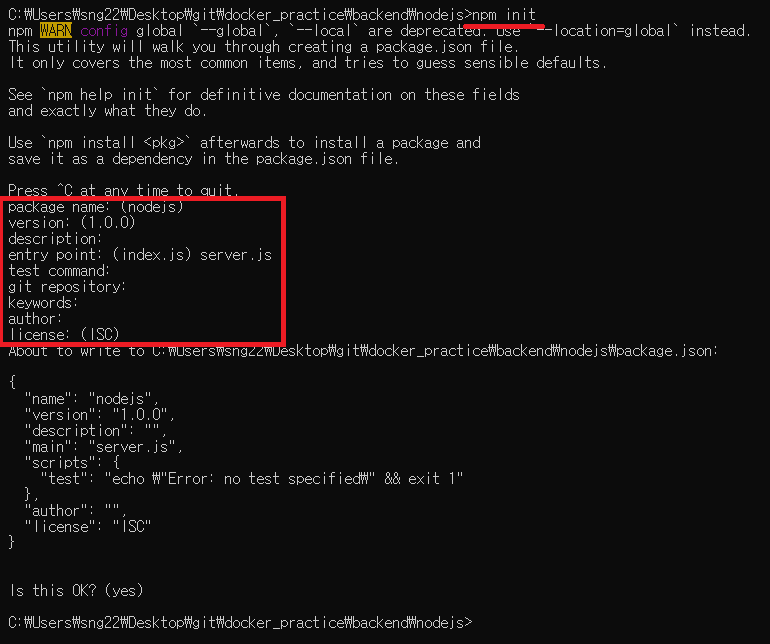

# Node.js 앱 만들기 순서
시작 전, node js를 설치해야한다.
1. package.json 생성
    - 프로젝트의 정보와 프로젝트에서 사용 중인 패키지의 의존성을 관리하는 곳
2. server.js 생성
    - 시작점(Entry Point)로서 가장 먼저 시작되는 파일
3. dockerfile 생성
    - 필요한 프로그램을 다운받고, 시작시 실행할 명령어 등록
4. 도커 이미지 생성
    - dockerfile을 통해 도커 이미지를 생성한다.
5. 도커 실행
    - 만들어진 이미지를 통해 도커를 실행시킨다.
## 1. package.json 만들기
- ```
  # package.json을 생성할 폴더로 이동
  $ cd \docker_practice\backend\nodejs
  
  # npm init을 통해 패키지 설정
  $ npm init
  ```
- 
- package.json에 express 기능 추가
- package.json에 start로 시작점 추가
    ```json
    {
    "name": "nodejs",
    "version": "1.0.0",
    "description": "",
    "main": "server.js",
    "scripts": {
        "test": "echo \"Error: no test specified\" && exit 1",
        // 시작점을 server.js로 설정
        "start":"node server.js"
    },
    "author": "",
    "license": "ISC",
    "dependencies": {
        // express 기능 추가
        "express": "4.18.1"
    }
    }
    ```

## 2. server.js 만들기
```js
const express = require('express');

// Constants
const PORT = 8080;
const HOST = '0.0.0.0';

// App
const app = express();
app.get('/', (req, res)=>{
    res.send('Hello World');
});

app.listen(PORT, HOST)
console.log("Running on http://${HOST}:$P{PORT}");
```

## 3. dockerfile 만들기
```dockerfile
# npm 명령어를 포함하는 베이스 이미지를 설정해야한다.
# node에는 npm이 포함되어있기에 node 이미지를 사용한다.
# 10버전을 사용한다.
FROM node:10

# npm : Node.js로 만들어진 모듈을 웹에서 받아서 설치하고 관리해주는 프로그램
# npm install을 통해 package.json에 적혀있는 종속성들을 웹에서 자동으로 다운 받아서 설치할 수 있다.
# 하지만, package.json이 컨테이너에 없기에 npm install만 쓸 경우 에러가 발생한다. 
# -> COPY를 사용하여 package.json을 컨테이너 안에 넣어야한다.

COPY package.json ./
RUN npm install

# node server.js로 server.js를 실행시킨다.
CMD ["node", "server.js"]
```

## 4. 도커 이미지 생성
```
# dockerfile이 있는 디렉토리로 이동
$ cd docker_practice\backend\nodejs

# 도커 이미지 생성
$ docker build -t devscof/nodejs ./
```

## 5. 도커 실행 및 server.js가 실행되었는지 확인
```
$ docker run devscof/nodejs ./
```