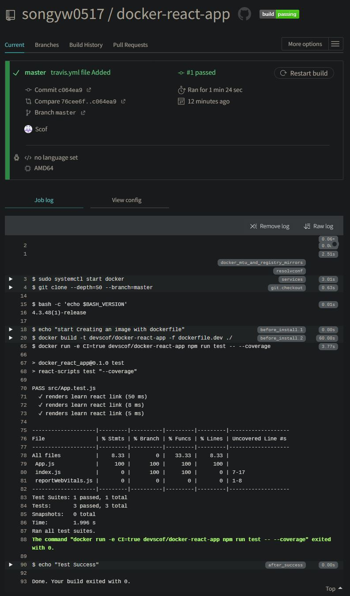
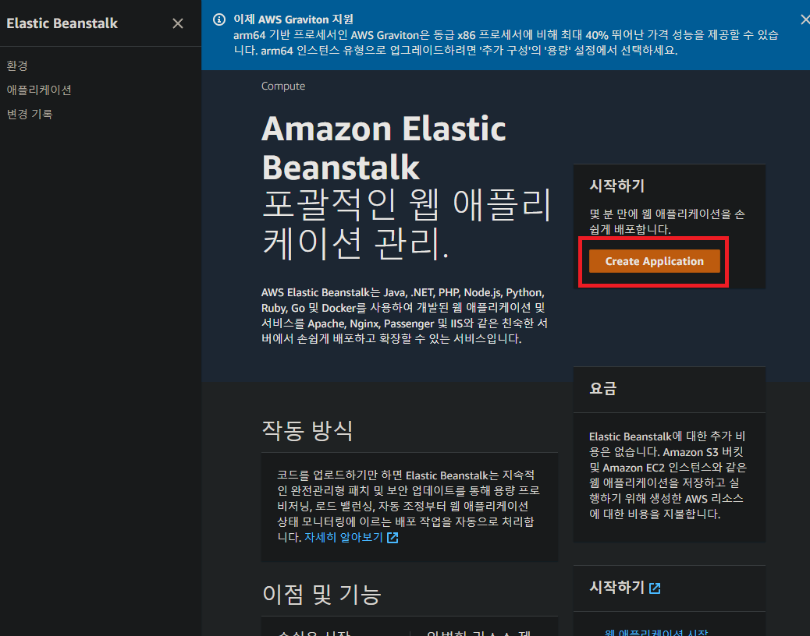
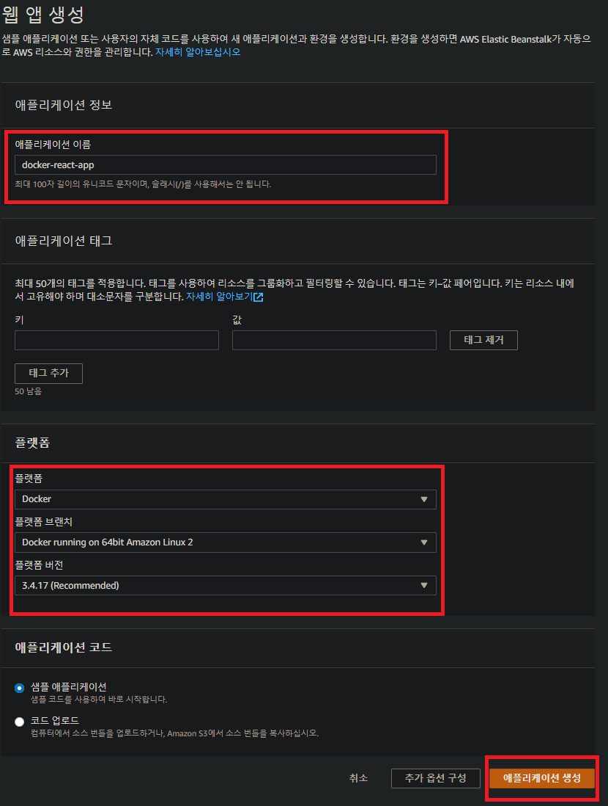
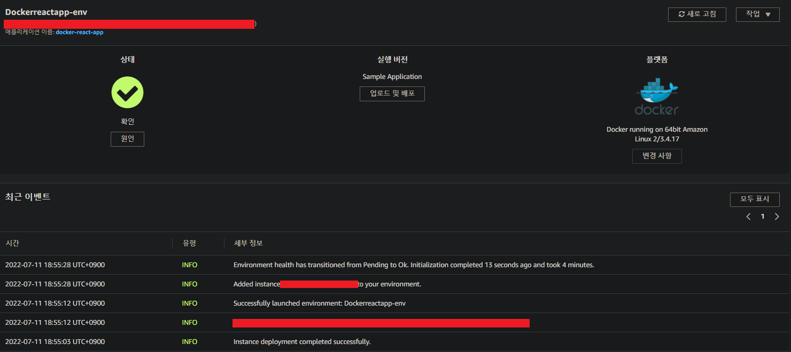
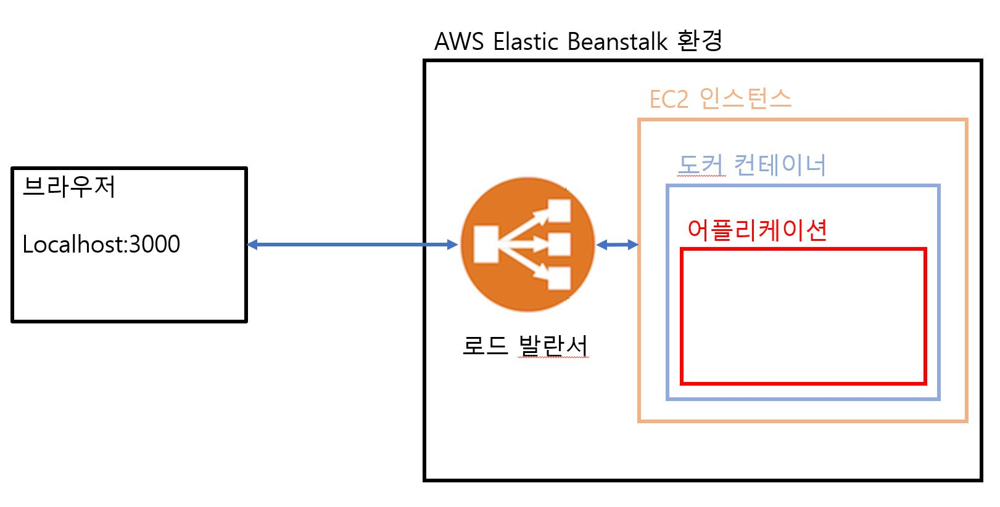

# * 간단한 어플을 실제로 배포해보기
## Travis CI란?
- Github에서 진행되는 오픈소스 프로젝트를 위한 지속적인 통합(Continuous Integration)서비스
- Travis CI를 이용하면 Github repository에 있는 프로젝트를 특정 이벤트에 따라 자동으로 <span style="color:yellow;">테스트</span>, 빌드하거나 <span style="color:yellow;">배포</span>할 수 있다.
- Private repository는 유료로 일정 금액을 지불하고 사용할 수 있다.

<br>

## Travis CI의 흐름
로컬 git -> github -> Travis CI -> AWS

1. 로컬 git에 있는 소스를 Github 저장소에 push
2. Github master 저장소에 소스가 Push되면 Travis CI에게 소스가 push됨을 알림
3. Travis CI는 업데이트된 소스를 Github에서 가져옴
4. Github에서 가져온 소스의 테스트 코드를 수행
5. 테스트 코드 실행 후, 테스트가 성공하면 AWS같은 호스팅 사이트로 보내어 배포한다.

## Travis CI 이용 순서
1. Github과 Travis CI 연결하기
    - [Travis CI 사이트](https://travis-ci.org)로 이동
    - Github 아이디로 회원가입 후 로그인
2. Github의 리포지토리 소스코드를 Travis CI에서 가져갈 수 있게 설정하기
    - Travis CI 사이트의 Setting들어가기
    - 프로젝트 리포지토리 선택 (없을시 Sync account을 누른뒤 확인)
    - setting -> Migrate에서 어떤 리포지토리를 활성화시킬 것인지 선택할 수 있다.
3. .travis.yml 작성하기<br>
    다음과 같은 내용들이 포함되어야 한다.
    - 도커 환경에서 리액트 앱을 실행하고 있으니, Travis CI에서도 도커환경을 구성해야한다.
    - 구성된 도커 환경에서 dockerfile.dev를 이용해서 도커 이미지를 생성
    - 어떻게 Test를 수행할 것인지 설정
    - Test가 완료된 후 어떤 작업을 수행할지 설정
    ```yml
    # .travis.yml

    # 권한 설정 : 관리자 권한
    sudo: required

    # 언어 설정 : generic
    language: generic

    # 필요한 서비스 설정 : 도커환경이므로, docker 설정
    services:
        - docker

    # 스크립트를 실행하기 위한 환경 구성
    # 도커이미지 만들기
    before_install:
        - echo "start Creating an image with dockerfile"
        - docker build -t devscof/docker-react-app -f dockerfile.dev ./

    # 실행할 스크립트(테스트) 설정
    # -e CI=true 는 Travis CI를 사용하기 위한 환경변수
    # --coverage 는 테스트 결과를 테이블 형태로 자세히 보여주는 옵션
    script:
        - docker run -e CI=true devscof/docker-react-app npm run test -- --coverage

    # 스크립트(테스트)가 성공한 이후 할 일 설정
    after_success:
        - echo "Test Success"
    ```
4. Github에 소스코드 올리기
    - ```git add .```
    - ```git commit -m "travis.yml file Added"```
    - ```git push origin master```
5. Travis Ci 사이트에서 잘 수행이 되었는지 확인

    
    
# AWS
## AWS란
Amazon Web Services<br>
아마존에서 운영하는 클라우드 컴퓨팅 플랫폼이다.
## EC2란
Elastic Compute Cloud<br>
컴퓨터 하나를 빌리는 것으로 생각하면 된다<br>
그리고 그 컴퓨터에 OS를 설치하고 웹 서비스를 위한 프로그램들(웹서버, DB 등)을 설치해서 사용할 수 있다.<br>
1대의 컴퓨터를 하나의 "EC2 인스턴스"라고 부른다.

## EB란
AWS Elastic Beanstalk<br>
Apach, NginX같은 웹 서버에서 Java, NET, PHP, Node.js, Python, Ruby, Go 및 Docker와 함께 개발된 웹 응용 프로그램 및 서비스를 배포하고 확장하기 쉬운 서비스이다.<br>
EC2 인스턴스나 데이터베이스 같이 많은 것들을 포함한 "환경"을 구성한다.<br>
또한 만들고 있는 소프트웨어를 업데이트 할 때마다 자동으로 이 환경을 관리해준다.

<br>

# EB 선택
## EB에서 어플리케이션 만들기
1. ### Create Application으로 어플리케이션 만들기
    - AWS 서비스 로그인하기ㅣ
    - Elastic Beanstalk 검색하기
    - Create Application 클릭하기
    - 
<br>

2. ### 어플리케이션 정보 입력 후 생성하기
    - 어플리케이션 이름, 플랫폼 설정 후 생성
    - 
<br>

* ### 완료 후 모습
    - <br><br><br>
    - 서비스 동작
    