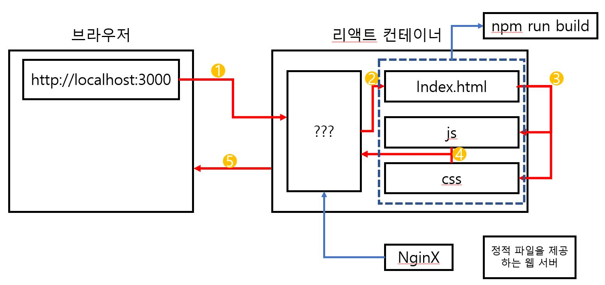

# * 리액트 설치
리액트를 설치하기 전, node(nodejs)가 설치되어있어야한다.
- ```$ node -v```로 확인이 가능하다.

## 리액트를 설치하기 위한 명령어
- 설치할 폴더로 이동
  - ```$ cd backend\docker_react_app```
- 리액트 설치
  - ```$ npx create-react-app [리액트를 설치하고자 하는 디렉토리 이름]```
  - ```$ npx create-react-app ./``` // 현재 디렉토리에 설치

## 리액트를 실행하기 위한 명령어
- ```$ npm run start```

## 리액트를 테스트하기 위한 명령어
- ```$ npm run test```

## 리액트를 빌드하기 위한 명령어
- ```$ npm run build```
- build 폴더에 빌드된다.

<br><br>

# * 도커를 이용하여 도커에서 리액트 실행하기
## 1. 개발하기 위한 dockerfile만들기 (dockerfile.dev)
```docker
# docker_react_app\dockerfile.dev


# 베이스 이미지 설정
FROM node:alpine

# ./을 /usr/src/app으로 설정
WORKDIR /usr/src/app

# package.json을 ./으로 복사
COPY package.json ./

# 종속성 다운로드
RUN npm install

#  ./으로 복사
COPY ./ ./

# 실행 명령 추가
CMD ["npm", "run", "start"]
```

<br>

## 2. dockerfile.dev로 이미지 만들기
- 원래는 dockerfile로 이미지를 만들 수 있었으나, 현재는 dockerfile.dev라는 파일로 만드는 것이기에
- build를 할 때 어떤 파일로 할지 알려줘야한다.
- 이전:
    - ``` $ docker build ./ ```
- 다른 파일로 이미지 만들기
    - -f 옵션 : 어떤 포맷으로 할지 결정
    - -t 옵션 : 이미지 이름 붙이기
    - ``` $ docker build -f dockerfile.dev -t devscof/docker-react-app ./```

<br>

## 3. node_modules에 대해
- 도커 환경이 아닌 경우 react 앱을 실행시키기 위해서는 node_modules가 필요하다.
- 하지만 "도커 환경"의 경우 node_modules가 필요하지 않다.
  - 게다가 node_modules가 있을 경우 용량이 큰 node_modules까지 빌드하기 때문에 빌드 시간도 더욱 늘어난다.
- > 도커환경의 경우 node_modules은 삭제하자

<br>

## 4. 포트 매핑
```
$ docker build -f dockerfile.dev -t devscof/docker-react-app ./
$ docker run devscof/docker-react-app
```
으로 도커를 실행시킨 후 react 앱은 3000번 포트를 사용하기에 localhost:3000을 접속하지만

로컬호스트와 컨테이너 간의 포트매핑을 하지 않았기에 접속할 수 없다.

해결 : 포트매핑 옵션을 준다.

``` $ docker run -it -p 7000:3000 devscof/docker-react-app ```

<br>

## 5. 접속
위에서 7000번 포트를 3000번(react)에 연결시켜줬으므로

'localhost:7000'으로 접속을 시도하면 다음과 같이 접속이 된다.


<br><br>

# 6. 볼륨(Volume)을 이용한 소스코드 변경
개발시 소스코드 변경이 잦은데, 소스코드가 변경될 때마다 이미지를 빌드하고 실행시키는 것은 매우 번거롭다.

그렇기에 소스코드 변경시, 바로 소스코드가 적용되게 하는 것이 중요하다.

이를 위해서는 docker의 volume을 사용한다.

## 볼륨을 사용하여 어플리케이션을 실행하는 방법
```
# 리눅스
docker -p [외부포트]:[내부포트] -v /usr/src/app/node_modules -v $(pwd):/usr/src/app [이미지 아이디]

# 윈도우
docker -p [외부포트]:[내부포트] -v /usr/src/app/node_modules -v %cd%:/usr/src/app [이미지 아이디]
```
- 현재 디렉토리에는 node_modules가 없기에 ```-v /usr/src/app/node_modules```를 통해 node_modules를 참조하지 않도록 설정한다.

<br><br>

## 7. react의 핫로딩 작동을 위한 package.json 파일 수정
- react의 핫로딩 : 코드가 변경되었을 때 페이지를 새로고침하지 않고 바뀐부분만 빠르게 교체해주는 것
- 리눅스나 맥에서는 핫로딩이 작동할 수 있으나, 윈도우 운영체제에서 개발할 경우 핫로딩이 적용이 되지않는다.
- 이를 해결하기 위해서는 package.json 파일을 수정해야한다. [문제해결 참고](https://stackoverflow.com/questions/71297042/react-hot-reload-doesnt-work-in-docker-container)
  
  ++) CHOKIDAR_USEPOLLING=true의 환경변수를 적용하는 방법이 있다고 하여 시도해봤지만 실패했다.<br>
  > Windows에서 react-scripts 5.xx 이상을 사용하는 경우 CHOKIDAR_USEPOLLING이 작동하지 않습니다.
- 하지만 "새로고침"을 해야 수정된다는 점이 아쉽다.
```json
// package.json

{
  "name": "docker_react_app",
  "version": "0.1.0",
  "private": true,
  "dependencies": {
    "@testing-library/jest-dom": "^5.16.4",
    "@testing-library/react": "^13.3.0",
    "@testing-library/user-event": "^13.5.0",
    "react": "^18.2.0",
    "react-dom": "^18.2.0",
    "react-scripts": "5.0.1",
    "web-vitals": "^2.1.4"
  },
  "scripts": {
    // WATCHPACK_POLLING=true을 추가한다.
    "start": "WATCHPACK_POLLING=true react-scripts start",
    "build": "react-scripts build",
    "test": "react-scripts test",
    "eject": "react-scripts eject"
  },
  "eslintConfig": {
    "extends": [
      "react-app",
      "react-app/jest"
    ]
  },
  "browserslist": {
    "production": [
      ">0.2%",
      "not dead",
      "not op_mini all"
    ],
    "development": [
      "last 1 chrome version",
      "last 1 firefox version",
      "last 1 safari version"
    ]
  }
}
```

실행 명령어(윈도우)
- ```docker run -it -p 7000:3000 -v /usr/src/app/node_modules -v %cd%:/usr/src/app devscof/docker-react-app```

<br><br>

# * 명령어가 길어서 싫어... (docker-compose)
위의 마지막 단계는 ```매우 긴 도커 실행 명령어```를 입력함으로써 끝이난다.

하지만, 매번 이렇게 긴 명령어를 써야할까? 아니다.

docker-compose를 사용한다면 간단하게 어플리케이션을 실행시킬 수 있다.

<br>

## docker-compose.yml 파일 작성
작성해야할 것
```docker
┌ version : "3"         # 도커 컴포즈의 버전
└ services :            # 실행하려는 컴테이너들을 정의
  └ [container name] :  # 컨테이너 이름
    ├ build :           # 
    │ ├ context : .     # 도커 이미지를 구성하기 위한 파일과 폴더들이 있는 위치, (.으로 현재 위치로 지정)
    │ └ dockerfile : dockerfile.dev # 어떤 도커 파일을 빌드할 것인지 지정, (dockerfile.dev 파일로 지정)
    ├ ports : "7000:3000" # 포트 매핑
    ├ volumnes:         # 볼륨 세팅
    │ ├ /usr/src/app/node_modules # /usr/src/app/node_modules는 참조하지 않겠다.
    │ └ ./:/usr/src/app # ./:/usr/src/app은 참조하겠다.
    └ stdin_open : true # 리액트 앱을 끌 때 사용
```
<br>

## docker-compose 명령어로 실행하기
- ```$ docker-compose up```

<br>

## 볼륨이 잘 적용되었는지 확인
src/App.js 부분을 변경하여 소스코드 변경시 잘 적용이 되는지 확인한다.

윈도우에서는 변경된 소스코드가 적용되는데까지 시간이 좀 걸린다.

<br>

# * 리액트 어플리케이션 테스트하기
리액트를 테스트 하기 전에, 먼저 이전에 변경해왔던 소스코드를 원상태로 복구해야한다. (node_modules도 있어야한다..)

리액트 테스트하기
- ```$ npm run test```

<br>

## 도커환경에서 리액트 어플리케이션 테스트하기
- ```$ docker run -it [이미지 이름] npm run test```
  - 이 명령어는 빌드된 이미지에 대한 테스트이다.
  - 볼륨이 적용될 수 없기에, 소스코드를 변경했어도 적용되지 않는다.
  - 즉, 빌드를 통해서 제대로 이미지를 테스트할 수 있다.

<br>

## 테스트에서도 볼륨을 적용하고 싶다.
```$ docker run -it [이미지 이름] npm run test``` 명령어의 경우,<br>
소스코드를 변경해도 이미지를 빌드하지 않는 이상,<br>
변경된 소스코드를 적용시킬 수 없었다.<br>

소스코드 변경을 적용시키기 위해 volume을 사용한 것과 같이 test를 위한 컨테이너를 compose파일에 만들어주면 된다.

## docker-compose.yml에 test 컨테이너 추가
```yml
...
tests:
  build:
    context: .
    dockerfile: dockerfile.dev
  volumes:
    - /usr/src/app/node_modules
    - ./:/usr/src/app
  command: ["npm", "run", "test"]
```

## docker-compose 빌드하기
- ```$ docker-compose up --build```

# * 개발환경과 운영환경 분리하기 (NginX)
## 웹 서버와 NginX
<br>

### 웹 서버
초기 웹 서비스는 정보 전달이 목적인 "문서 위주"의 "정적 페이지"였다.<br>
그렇기에 HTML과 같은 문서를 서버에서 보내주기만 하면 됐다.<br>
이후 조금 발전된 형태로 스크립트 언어를 얹은 동적 페이지가 등장했지만 이때까지만 하더라도 서버에서 데이터를 처리하고 클라이언트로 전송해주는데 큰 부담이 되지 않았다.<br>
하지만 ```SPA(Single Page Application)``` 개념이 등장하면서 서버가 분리될 필요성이 생겼다.<br>
SPA는 기존의 웹 페이지와 달리, "갱신에 필요한 데이터만을 전달받아 페이지를 갱신"한다.<br>
이때 필요한 데이터는 사용자마다 달라졌고, 복잡한 연산이 필요하기도 했다.<br>
그래서 ```Web Server```와 ```WAS(Web Application Server)```같은 개념이 생겼다.
- Web Server :  클라이언트의 요청을 처리하는 기능 담당
- WAS : DB조회나 다양한 로직을 처리하는 기능 담당

-> NginX는 위의 ```Web Server```의 구축을 도와주는 소프트웨어이다.

<br>

### NginX
NginX는 ```Web Server```의 구축을 도와주는 소프트웨어로, "웹 서버 소프트웨어"라고도 불린다.
- 웹 서버 소프트웨어 : ```Web Server```의 구축을 도와주는 소프트웨어

<br>

### 웹 서버 소프트웨어 (Apache와 NginX)
- Apache 는 스레드/프로세스 기반으로 하는 방식으로 요청을 처리하는데, 요청 하나당 스레드 하나가 처리하는 구조로 사용자가 많아지면 CPU 와 메모리 사용이 증가해서 성능이 저하될 수 있다고 한다.
- NginX 는 비동기 이벤트 기반으로 하는 방식으로 처리하는데 요청이 들어오면 어떤 동작을 해야하는지만 알려주고 다음 요청을 처리하는 방식으로 진행된다고 하는데, 흐름이 끊기지 않고 응답이 빠르다고 한다.

[참고](https://tecoble.techcourse.co.kr/post/2021-07-30-web-server-and-nginx/)

## 개발환경과 운영환경을 분리하자
### * 개발환경과 운영환경을 분리하는 이유
먼저 "개발환경에서 리액트가 실행되는 과정"과 "운영환경에서 리액트가 실행되는 과정"을 확인해보자<br><br>

###  개발환경에서 리액트가 실행되는 과정


1. 브라우저에서 개발 서버에 요청
2. 개발서버에서 브라우저에서 요청한 리소스들(index.html, js, css)을 반환(2~5 과정)

<br><br>

### 도커환경에서 리액트가 실행되는 과정


1. 브라우저에서 "웹 서버"에 요청
2. "웹 서버"에서 리소스를 반환

<br>

### 차이점, 왜 굳이 NginX를 써야하는가
```# NginX의 필요성```
- 개발에서 사용하는 서버는 소스를 변경하면 자동으로 전체 앱을 다시 빌드해서 변경된 소스를 반영해주는 기능 등, 개발환경에 특화된 기능들이 있다.
- 만약 소스코드의 변경때마다 서비스에 계속 변동이 생긴다면 문제가 생길 수 있다.
- NginX를 사용할 경우 개발환경의 여러 기능보다는 서비스를 운영하는데 초점이 맞춰져있기에 개발환경보다 <span style="color:red">가볍다</span>

<br>

### 도커파일로 환경을 나누자
- <span style="color:yellow">개발 환경</span> : dockerfile.dev
- <span style="color:yellow">운영 환경</span> : dockerfile


\* 개발환경의 경우 start

\* 운영환경의 경우 build를 한 이후에 NginX로 시작한다.

<br>

### 운영 환경 도커파일 생성
- #### 운영 환경에서의 동작과정
  1. 빌드 파일들을 생성한다.(Builder Stage)
  2. NginX를 가동하고 빌드폴더의 파일들을 웹 브라우저의 요청에 따라 제공한다. (Run Stage)
- #### 도커파일 만들기
  ```docker
  # dockerfile
  # 빌드 파일 생성
  FROM node:alpine as builder
  WORKDIR '/usr/src/app'
  COPY package.json ./
  RUN npm install
  COPY ./ ./
  RUN npm run build
  # NginX로 시작
  FROM nginx
  COPY --from=builder /usr/src/app/build /usr/share/nginx/html
  ```
- #### 도커파일로 빌드하기
  ```$ sudo docker build ./ -t docker-react-nginx```
- #### nginx로 실행하기
  - 개발환경에서 리액트에 연결하기 위한 포트가 3000이었다면<br>
  - NginX에서의 포트는 80번이다.
  ```$ sudo docker run -p 8080:80 docker-react-nginx```