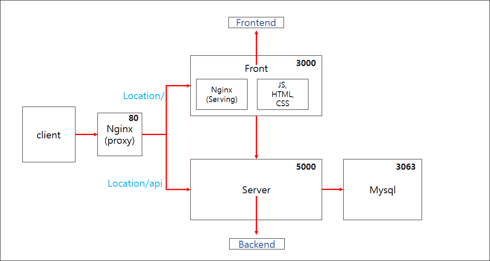
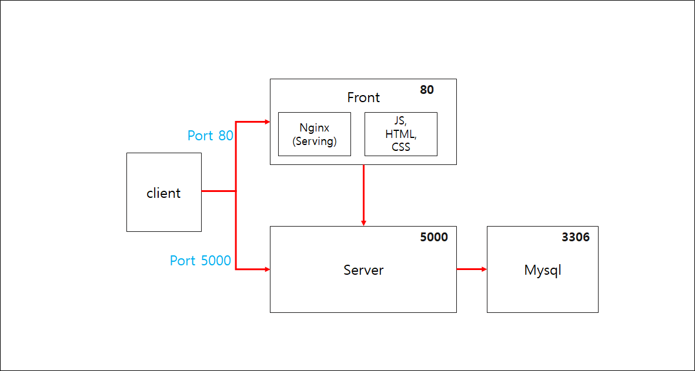

# 풀스택 어플리케이션 (개발)
## 어플리케이션 설명
- 리액트에서 MySQL에 저장된 데이터를 보여준다.
- 리액트에서 글을 입력하면, MySQL 데이터베이스에 저장한다.

## 설계
Nginx의 Proxy를 사용할 것인지에 따라 두가지로 나뉜다.
- Proxy를 이용할 경우
    
- 정적파일만을 제공해주는 경우
    

### 장단점
1. proxy를 사용할 경우
    - 장점
        - Request를 보낼때, URL 부분을 host 이름이 바뀌어도 변경시켜주지 않아도 된다.
        - 포트가 바뀌어도 변경을 안해줘도 된다.
    - 단점
        - nginx 설정, 전체 설계가 복잡해진다.
2. proxy를 사용하지 않을 경우
    - 장점
        - 설계가 단순하여 구현하기 쉽다.
    - 단점
        - host name이나 포트변경이 있을 때, Request URL도 변경시켜야한다.

 

# proxy를 사용하는 어플리케이션 개발
순서
1. [Node JS 구성하기](https://github.com/songyw0517/docker_study/blob/main/doc/mulit_container_application_dev/create_nodejs.md)
2. [React JS 구성하기](https://github.com/songyw0517/docker_study/blob/main/doc/mulit_container_application_dev/create_reactjs.md)
3. [리액트 앱을 위한 도커 파일 만들기](https://github.com/songyw0517/docker_study/blob/main/doc/mulit_container_application_dev/create_docker_reactjs.md)
4. [노드 앱을 위한 도커 파일만들기](https://github.com/songyw0517/docker_study/blob/main/doc/mulit_container_application_dev/create_docker_nodejs.md)
5. [MySQL을 위한 도커 파일 만들기](https://github.com/songyw0517/docker_study/blob/main/doc/mulit_container_application_dev/create_docker_mysql.md)
6. [Nginx를 위한 도커 파일 만들기](https://github.com/songyw0517/docker_study/blob/main/doc/mulit_container_application_dev/create_docker_nginx.md)
7. [Docker Compose 파일 작성하기](https://github.com/songyw0517/docker_study/blob/main/doc/mulit_container_application_dev/create_docker_compose.md)
8. [Docker Volume을 이용한 데이터베이스 데이터 유지하기](https://github.com/songyw0517/docker_study/blob/main/doc/mulit_container_application_dev/create_docker_volume.md)
