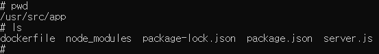

# 왜 WORKING DIRECTORY가 필요한가?
- COPY ./ ./을 할 경우, 복사되는 모든 파일, 디렉토리가 모두 '루트 디렉토리'로 복사된다.
- 만약 복사된 파일, 디렉토리가 기존의 루트 디렉토리의 파일, 디렉토리의 이름이 겹칠 경우 -> 덮어씌어지기에 문제가 발생할 수 있다.
- 또한 관리하기도 힘들다.
- 그렇기에 WORKDIR을 지정함으로써 프로그램을 실행시키기 위한 파일, 디렉토리를 한 곳에 보관한다.

## 1. dockerfile을 수정한다.
```docker
# npm 명령어를 포함하는 베이스 이미지를 설정해야한다.
# node에는 npm이 포함되어있기에 node 이미지를 사용한다.
# 10버전을 사용한다.
FROM node:10

# WORKDIR을 지정함으로써 프로그램을 실행시키는데 필요한
# 파일, 디렉토리를 한 곳에 모아 보관한다.
WORKDIR /usr/src/app

# npm : Node.js로 만들어진 모듈을 웹에서 받아서 설치하고 관리해주는 프로그램
# npm install을 통해 package.json에 적혀있는 종속성들을 웹에서 자동으로 다운 받아서 설치할 수 있다.
# 하지만, package.json이 컨테이너에 없기에 npm install만 쓸 경우 에러가 발생한다. 
# -> COPY를 사용하여 package.json을 컨테이너 안에 넣어야한다. // COPY package.json ./
# 그러면, server.js가 같은 이유로 에러가 발생한다. 디렉토리의 모든 파일을 복사해야한다. // COPY ./ ./
COPY ./ ./
RUN npm install

# node server.js로 server.js를 실행시킨다.
CMD ["node", "server.js"]
```

## 2. 다시 이미지를 빌드한다.
```$ docker build -t devscof/nodejs ./``` 

## 3. 컨테이너를 생성하고 쉘환경에 접근한다.
```$ docker run -it devscof/nodejs sh```

## 4. WORKDIR로 지정한 곳에 모두 들어갔는지 확인한다.
